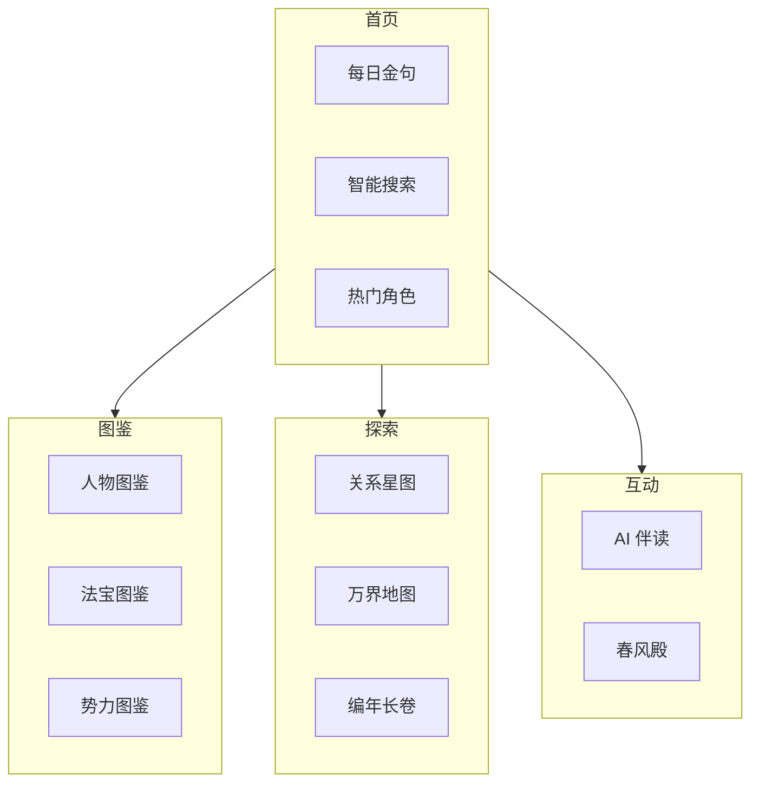

# 《剑来》知识图谱小程序 PRD

> **产品名称**: 剑来 · 万象图录  
> **版本**: v1.0 MVP  
> **平台**: 微信小程序  
> **文档日期**: 2025-12-29

---

## 1. 产品概述

### 1.1 产品定位
一款基于 AI 知识图谱的《剑来》沉浸式伴读工具，帮助读者理解复杂人物关系、追踪角色成长、探索世界观，并提供情感共鸣的社交出口。

### 1.2 目标用户
| 用户群体 | 特征 | 核心诉求 |
|---------|------|---------|
| 动漫党 | 未看原著，通过动漫入坑 | **降维理解**：搞懂复杂伏笔和人物动机 |
| 原著党 | 追更多年，情感深厚 | **情感共鸣**：找同好、祭奠意难平角色 |
| 考据党 | 热衷细节、设定挖掘 | **信息检索**：快速查询人物/法宝/势力 |

### 1.3 核心价值主张
> **「三千道藏浩如烟海，万象图录一指可寻」**

- ✅ **看得懂**：交互式知识图谱，降低阅读门槛
- ✅ **查得快**：AI 驱动的智能问答，即问即答
- ✅ **聊得爽**：情感树洞与分享机制，找到同道中人

---

## 2. 用户需求分析

### 2.1 需求象限图
```
          高频
           │
   ┌───────┼───────┐
   │ 人物关系 │ 金句分享 │
   │  查询   │  传播   │
   ├────────┼────────┤ 核心
   │ AI问答  │ 地图探索 │
   │ 解惑   │  漫游   │
   └────────┼────────┘
           │
          低频
```

### 2.2 用户故事 (User Stories)

| ID | 作为... | 我想要... | 以便于... | 优先级 |
|----|--------|----------|----------|-------|
| US-01 | 动漫观众 | 看某个角色的完整资料和关系网 | 理解他为什么这么做 | P0 |
| US-02 | 追更读者 | 问"陈平安为什么送簪子" | 不剧透地获得解答 | P0 |
| US-03 | 情感粉丝 | 给齐静春"敬酒"并写信 | 宣泄意难平，找共鸣 | P1 |
| US-04 | 考据党 | 搜索某把飞剑的所有持有者 | 整理法宝传承脉络 | P1 |
| US-05 | 新入坑者 | 看"剧情大事记"时间线 | 快速了解故事骨架 | P2 |

---

## 3. 功能模块设计

### 3.1 模块总览



---

### 3.2 模块详细规格

#### 📖 模块 A：人物图鉴
**定位**：角色百科全书，解决"这人是谁"的困惑

| 功能点 | 描述 | 数据来源 |
|-------|------|---------|
| 角色卡片 | 头像/名字/别名/势力/修为境界 | `characters.json` |
| 修为时间线 | ECharts 折线图展示境界成长 | `cultivation_log` |
| 关系网络 | 小型力导向图，仅展示 ±1 跳关系 | `relations.json` |
| 经典语录 | 该角色所有金句列表 | `quotes.json` (按 speaker 过滤) |

**交互流程**：
```
列表页(可筛选势力/境界) → 点击卡片 → 详情页 → 可跳转到关联角色
```

---

#### 🔗 模块 B：关系星图
**定位**：人物关系可视化，解决"他俩什么关系"的困惑

| 功能点 | 描述 | 数据来源 |
|-------|------|---------|
| 力导向图 | 节点=人物，边=关系类型 | `relations.json` |
| 关系详情 | 点击边显示原文证据 (evidence) | `relations.evidence` |
| 筛选器 | 按势力/关系类型筛选 | `factions`, `relation.type` |

**技术方案**：使用 `echarts-for-weixin` 实现关系图，移动端优化触摸交互。

---

#### 🗺️ 模块 C：万界地图
**定位**：世界观导览，解决"这是哪里"的困惑

| 功能点 | 描述 | 数据来源 |
|-------|------|---------|
| 层级地图 | 浩然天下 → 宝瓶洲 → 龙泉郡 → 落魄山 | `locations.json` (parent 字段) |
| 地点详情 | 描述、关联势力、重要事件 | `locations`, `events` |

**MVP 简化**：首版使用树形列表代替真实地图绘制。

---

#### 💬 模块 D：AI 伴读
**定位**：智能问答，解决"为什么"的困惑

| 功能点 | 描述 | 技术方案 |
|-------|------|---------|
| 自然语言提问 | "陈平安为什么送簪子给宁姚" | RAG (检索增强生成) |
| 上下文感知 | 根据用户当前阅读进度（章节）过滤回答 | 章节滑块选择 |
| 不剧透模式 | 默认只引用所选章节及之前的内容 | 后端过滤 |

**技术架构**：
```
用户问题 → 云函数 → 向量检索(全量知识库) → 过滤(章节范围) → LLM 生成回答
```

---

#### 🌸 模块 E：春风殿
**定位**：情感树洞，解决"我要祭奠意难平"的需求

| 功能点 | 描述 |
|-------|------|
| 角色纪念碑 | 为齐静春、阿良等角色设立虚拟纪念页 |
| 敬酒/送剑 | 用户可选择"仪式动作"并留言 |
| 道友留言墙 | 滚动展示其他用户的留言 |
| 分享海报 | 生成带用户留言的精美海报 |

---

#### 📅 模块 F：编年长卷
**定位**：剧情时间线，解决"故事发展脉络"的困惑

| 功能点 | 描述 | 数据来源 |
|-------|------|---------|
| 时间轴 | 按章节排序的大事件列表 | `timeline.json` |
| 事件详情 | 事件名/类型/参与者/描述 | `events` |

---

## 4. 数据架构

### 4.1 数据流图
```
┌─────────────────┐     ┌─────────────────┐     ┌─────────────────┐
│  原始小说文本   │ ──► │ extract_pipeline│ ──► │   data/raw/     │
│  chapters/*.txt │     │   (Gemini API)  │     │  per-chapter.json│
└─────────────────┘     └─────────────────┘     └────────┬────────┘
                                                         │
                                                         ▼
                        ┌─────────────────┐     ┌─────────────────┐
                        │ build_knowledge │ ◄── │   Aggregation   │
                        │     _base.py    │     │   & Merging     │
                        └────────┬────────┘     └─────────────────┘
                                 │
         ┌───────────────────────┼───────────────────────┐
         ▼                       ▼                       ▼
┌─────────────────┐     ┌─────────────────┐     ┌─────────────────┐
│ characters.json │     │  timeline.json  │     │ search_index.json│
│ (聚合后人物)    │     │  (时间线事件)   │     │  (搜索索引)      │
└────────┬────────┘     └────────┬────────┘     └────────┬────────┘
         │                       │                       │
         └───────────────────────┴───────────────────────┘
                                 │
                                 ▼
                        ┌─────────────────┐
                        │  微信云数据库   │
                        │  (Cloud DB)     │
                        └────────┬────────┘
                                 │
                                 ▼
                        ┌─────────────────┐
                        │  微信小程序     │
                        │  (Frontend)     │
                        └─────────────────┘
```

### 4.2 核心数据结构 (已实现)

| 文件 | 内容 | 记录数 (预估) |
|-----|------|-------------|
| `characters.json` | 人物档案 (含 cultivation_log) | ~500+ 人物 |
| `relations.json` | 人物关系 (含 evidence) | ~2000+ 关系 |
| `items.json` | 法宝神兵 (含 ownership_log) | ~300+ 物品 |
| `locations.json` | 地点 (含层级) | ~200+ 地点 |
| `factions.json` | 势力宗门 | ~100+ 势力 |
| `quotes.json` | 金句语录 | ~1000+ 金句 |
| `timeline.json` | 大事件时间线 | ~500+ 事件 |

---

## 5. 技术方案

### 5.1 技术栈

| 层级 | 技术选型 | 说明 |
|-----|---------|------|
| 前端 | 微信小程序原生 + Vant Weapp | 轻量级 UI 组件库 |
| 图表 | ECharts for WeChat | 关系图、时间线 |
| 后端 | 微信云开发 (云函数+云数据库) | Serverless，免运维 |
| AI | 云函数调用 Gemini API | RAG 问答 |
| 存储 | 云数据库 + 云存储 | JSON 数据 + 图片资源 |

### 5.2 性能优化策略

| 问题 | 解决方案 |
|-----|---------|
| 关系图节点过多卡顿 | 分层加载：首屏只展示核心角色，滚动触发延迟加载 |
| 首屏加载慢 | 预加载热门角色数据，本地缓存 |
| 云数据库查询慢 | 建立索引（name, faction, chapter） |

---

## 6. MVP 路线图

### Phase 1：基础图鉴 (2 周)
- [x] 数据提取管道完成
- [x] 知识库聚合脚本完成
- [ ] 小程序项目初始化
- [ ] 人物图鉴页面 (列表+详情)
- [ ] 云数据库部署

### Phase 2：探索功能 (2 周)
- [ ] 关系星图交互
- [ ] 编年长卷时间线
- [ ] 全局搜索

### Phase 3：AI + 情感 (2 周)
- [ ] AI 伴读问答
- [ ] 春风殿（情感模块）
- [ ] 分享海报生成

### Phase 4：迭代优化 (持续)
- [ ] 万界地图（真实地图渲染）
- [ ] 用户系统 + 本命角色
- [ ] 社区功能

---

## 7. 成功指标 (KPI)

| 指标 | 目标 (MVP 上线 1 个月) |
|-----|----------------------|
| DAU | 1,000+ |
| 人均停留时长 | 5 分钟+ |
| AI 问答使用率 | 30%+ 用户至少问过一次 |
| 分享率 | 10%+ 用户生成过海报 |

---

## 8. 风险与应对

| 风险 | 影响 | 应对措施 |
|-----|------|---------|
| 版权风险 | 小说内容侵权 | 不展示原文，只展示结构化信息；引导购买正版 |
| AI 幻觉 | 回答不准确 | 标注"AI 生成仅供参考"；提供原文出处链接 |
| 数据量大 | 加载慢/费用高 | 分批加载；设置数据缓存 |

---

## 9. 设计规范 (Design System)

### 9.1 设计理念

> **「水墨丹青，剑意凌云」**

整体风格融合 **中国传统水墨美学** 与 **现代极简设计**，营造沉浸式的武侠/仙侠氛围。

| 设计原则 | 说明 |
|---------|------|
| **意境优先** | 用留白、渐变、晕染营造"山水画"般的视觉层次 |
| **克制表达** | 避免过度装饰，让内容成为主角 |
| **触感反馈** | 每个交互都有细腻的动效回应，增强沉浸感 |
| **可读至上** | 信息分层清晰，视觉疲劳最小化 |

---

### 9.2 色彩系统 (Color Palette)

#### 主色调 (Primary)
| 名称 | 色值 | 用途 |
|-----|------|------|
| **剑气青** | `#3A6EA5` | 主按钮、选中态、关键信息 |
| **墨染灰** | `#1F2937` | 标题、正文 |
| **宣纸白** | `#F9FAFB` | 背景底色 |

#### 辅助色 (Secondary)
| 名称 | 色值 | 用途 |
|-----|------|------|
| **丹砂红** | `#DC2626` | 警示、重要标记 |
| **春风绿** | `#059669` | 成功、正向反馈 |
| **金箔黄** | `#D97706` | 徽章、等级高亮 |
| **云岚紫** | `#7C3AED` | AI 相关功能标识 |

#### 语义色 (Semantic)
| 场景 | 色值 |
|-----|------|
| 分割线 | `#E5E7EB` |
| 禁用态 | `#9CA3AF` |
| 遮罩层 | `rgba(0,0,0,0.5)` |

#### 深色模式 (Dark Mode)
| 元素 | 浅色模式 | 深色模式 |
|-----|---------|---------|
| 背景 | `#F9FAFB` | `#111827` |
| 卡片 | `#FFFFFF` | `#1F2937` |
| 正文 | `#1F2937` | `#F3F4F6` |

---

### 9.3 字体规范 (Typography)

| 层级 | 字号 | 字重 | 行高 | 用途 |
|-----|-----|------|-----|------|
| H1 大标题 | 24px | Bold | 1.4 | 页面主标题 |
| H2 二级标题 | 18px | Semibold | 1.4 | 模块标题 |
| H3 三级标题 | 16px | Medium | 1.5 | 卡片标题 |
| Body 正文 | 14px | Regular | 1.6 | 正文内容 |
| Caption 注释 | 12px | Regular | 1.5 | 辅助说明 |
| Quote 引用 | 16px | Light (斜体) | 1.8 | 金句展示 |

**字体选择**：
- 中文：系统默认 (PingFang SC / 思源黑体)
- 英文/数字：SF Pro Text
- 特殊场景（如引用）：可考虑使用 **楷体** 以增加古风感

---

### 9.4 间距与栅格 (Spacing & Grid)

#### 基础间距单位
采用 **4px** 为基础单位，所有间距为 4 的倍数。

| 名称 | 值 | 用途 |
|-----|---|-----|
| xs | 4px | 图标与文字间距 |
| sm | 8px | 紧凑元素间距 |
| md | 16px | 常规模块间距 |
| lg | 24px | 区块分隔 |
| xl | 32px | 页面边距 |

#### 页面栅格
- 屏幕边距：左右各 `16px`
- 卡片间距：`12px`
- 列表项高度：`56px`（单行）/ `72px`（双行）

---

### 9.5 组件规范 (Component Library)

#### 9.5.1 卡片 (Card)
```
┌─────────────────────────────┐
│  [角色头像]  陈平安         │  ← H3 标题
│             泥瓶巷少年       │  ← Caption 副标题
│  ┌───┐ ┌───┐ ┌───┐        │
│  │剑修│ │武夫│ │落魄山│     │  ← Tag 标签组
│  └───┘ └───┘ └───┘        │
└─────────────────────────────┘
```
- 圆角：`12px`
- 阴影：`0 2px 8px rgba(0,0,0,0.08)`
- 背景：白色 / 深色模式卡片色

#### 9.5.2 标签 (Tag)
| 类型 | 样式 |
|-----|------|
| 势力标签 | 填充色 + 白字 |
| 境界标签 | 描边 + 主色字 |
| 关系标签 | 浅色背景 + 深色字 |

#### 9.5.3 按钮 (Button)
| 类型 | 样式 | 用途 |
|-----|------|------|
| Primary | 实心 剑气青 | 主要操作 |
| Secondary | 描边 剑气青 | 次要操作 |
| Ghost | 纯文字 | 链接/弱操作 |
| Danger | 实心 丹砂红 | 危险操作 |

**按钮尺寸**：
- Large：高度 48px，圆角 24px
- Medium：高度 36px，圆角 18px
- Small：高度 28px，圆角 14px

#### 9.5.4 输入框 (Input)
- 高度：`44px`
- 圆角：`8px`
- 边框：`1px solid #E5E7EB`
- 聚焦态：边框变为 `剑气青`，带 `box-shadow`

#### 9.5.5 弹窗 (Modal / ActionSheet)
- 从底部滑入，带遮罩
- 圆角：顶部 `16px`
- 最大高度：屏幕的 `70%`

---

### 9.6 图标规范 (Iconography)

| 规格 | 尺寸 | 用途 |
|-----|-----|------|
| 小图标 | 16×16 | 列表辅助 |
| 中图标 | 24×24 | 导航栏、常规操作 |
| 大图标 | 32×32 | 功能入口 |

**风格**：采用 **线性图标 (Outline)**，线宽 1.5px，与水墨风格呼应。

**推荐图标库**：
- [RemixIcon](https://remixicon.com/) — 开源、风格统一
- 自定义：针对"飞剑"、"山"、"剑气"等元素手绘 SVG

---

### 9.7 动效规范 (Motion & Animation)

#### 动效原则
1. **自然流畅**：模拟物理运动，如惯性、弹性
2. **克制有度**：动效时长控制在 200-400ms
3. **突出反馈**：让用户感知操作结果

#### 常用动效曲线
| 名称 | Easing | 用途 |
|-----|--------|------|
| 标准 | `ease-out` | 元素进入 |
| 离场 | `ease-in` | 元素退出 |
| 弹性 | `cubic-bezier(0.68, -0.55, 0.27, 1.55)` | 按钮点击、卡片弹出 |

#### 页面转场
| 场景 | 动效 |
|-----|------|
| 列表 → 详情 | 共享元素动画（头像放大过渡） |
| 返回 | 右滑手势 + 页面右移淡出 |
| 弹窗出现 | 底部上滑 + 遮罩渐显 |

#### 微交互示例
| 元素 | 交互 | 动效 |
|-----|------|------|
| 卡片 | 点击 | 轻微缩放 (0.98) + 阴影加深 |
| 按钮 | 点击 | 涟漪扩散 (ripple) |
| 加载 | 等待 | 剑光流动 / 墨水晕染 |
| 点赞 | 点击 | 心形放大 + 粒子飞散 |

---

### 9.8 交互规范 (Interaction Patterns)

#### 9.8.1 导航结构
```
┌─────────────────────────────┐
│          顶部导航栏          │  ← 固定，含返回/标题/操作
├─────────────────────────────┤
│                             │
│          页面内容区          │  ← 可滚动
│                             │
├─────────────────────────────┤
│  首页  图鉴  探索  AI  我的  │  ← 底部TabBar (5个入口)
└─────────────────────────────┘
```

#### 9.8.2 手势操作
| 手势 | 场景 | 响应 |
|-----|------|------|
| 左滑 | 列表项 | 显示操作按钮（收藏/分享） |
| 右滑 | 页面 | 返回上一页 |
| 双指缩放 | 关系图 | 放大/缩小视图 |
| 长按 | 卡片 | 显示快捷操作菜单 |

#### 9.8.3 加载状态
| 场景 | 表现 |
|-----|------|
| 首屏加载 | 骨架屏 (Skeleton) |
| 列表加载更多 | 底部旋转动画 |
| AI 回答生成 | 打字机效果 + 光标闪烁 |

#### 9.8.4 空状态设计
| 场景 | 展示 |
|-----|------|
| 搜索无结果 | 插画 + "江湖茫茫，暂无此人" |
| 收藏为空 | 插画 + "尚无珍藏，快去探索" |
| 网络错误 | 插画 + "剑气断联，请重试" |

#### 9.8.5 无障碍 (Accessibility)
- 所有图片必须有 `alt` 描述
- 色彩对比度符合 WCAG AA 标准
- 支持系统字体大小调整
- 关键操作支持触觉反馈 (Haptic)

---

### 9.9 品牌视觉元素

#### Logo
- 主 Logo：「万象图录」四字，书法体 + 剑纹装饰
- 图形 Logo：一柄抽象飞剑，呈"人"字形（寓意"以人为本"）

#### 启动页 (Splash Screen)
- 全屏水墨山水背景
- 中央 Logo 渐显
- 底部产品口号：「三千道藏浩如烟海，万象图录一指可寻」

#### 分享海报模板
```
┌───────────────────────────────┐
│  [水墨云山背景]               │
│                               │
│      "人生至味是清欢"         │  ← 用户选择的金句
│                               │
│           —— 陈平安           │  ← 说话人
│                               │
│  ┌─────────────────────────┐ │
│  │ 扫码探索剑来世界         │ │  ← 小程序码
│  └─────────────────────────┘ │
└───────────────────────────────┘
```

---

## 附录：页面原型建议

> 可使用 Figma 或 generate_image 工具生成 UI Mockup。

### 人物详情页结构
```
┌─────────────────────────────────────┐
│ [返回]        陈平安        [分享] │
├─────────────────────────────────────┤
│                                     │
│         [头像占位]                  │
│                                     │
│  别名: 泥瓶巷少年、草鞋少年        │
│  势力: 落魄山                       │
│  修为: 玉璞境                       │
│                                     │
├─────────────────────────────────────┤
│  📈 修为成长                        │
│  [────────●───────────────]        │
│   凡人 → 二境 → ... → 玉璞境       │
├─────────────────────────────────────┤
│  🔗 人物关系                        │
│  ┌─────┐     ┌─────┐              │
│  │宁姚 │────│陈平安│              │
│  └─────┘     └─────┘              │
├─────────────────────────────────────┤
│  💬 经典语录                        │
│  "世间事，人间情，皆需一个'忍'字" │
└─────────────────────────────────────┘
```

