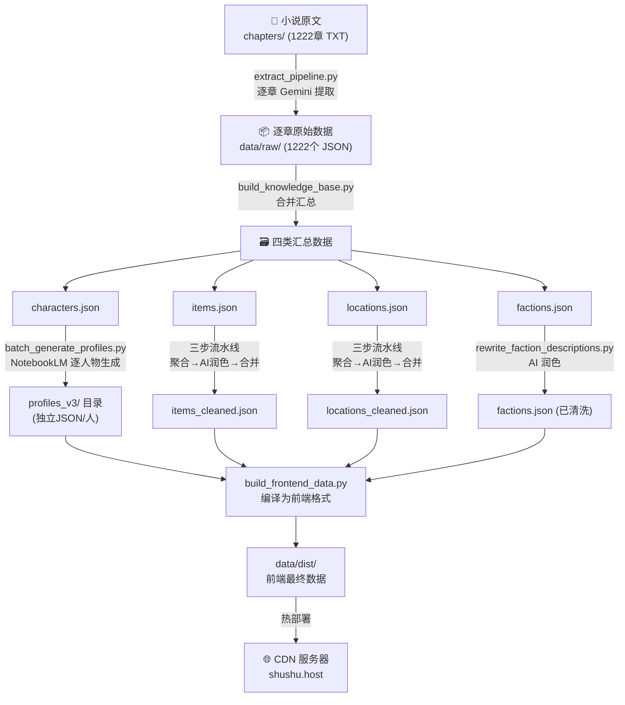

# 剑来小程序 — 数据生成流程文档

> 本文档详细记录了项目中四类核心数据的生成全流程。

## 总览



---

## 第一层：原始数据提取

### 输入

| 项目 | 说明                                 |
| ---- | ------------------------------------ |
| 来源 | `/chapters/` 目录下 1222 个 TXT 文件 |
| 格式 | `第1章 惊蛰.txt` ~ `第1222章 ...txt` |

### 脚本：[extract_pipeline.py](file:///Users/shushu/剑来/extract_pipeline.py)

**工作原理**：逐章读取小说原文，通过本地 Gemini API（`gcli2api` 代理）提取结构化数据。

**提取的七类实体**：

| 类别           | 字段                                           |
| -------------- | ---------------------------------------------- |
| **characters** | name, bio, aliases, faction, cultivation, tags |
| **relations**  | source, target, relation, strength, evidence   |
| **items**      | name, type, owner, description, rank           |
| **locations**  | name, type, parent, description                |
| **factions**   | name, type, description, members               |
| **quotes**     | speaker, text, context                         |
| **events**     | description, participants, chapter             |

**输出**：`data/raw/` 目录下 1222 个 JSON 文件（如 `006_第1章 惊蛰.json`）

**API 配置**：
- 端点：`http://127.0.0.1:7861/v1`（gcli2api 本地代理）
- 模型：`gemini-3-pro-preview` / `gemini-3-pro-high`

---

## 第二层：数据汇总

### 脚本：[build_knowledge_base.py](file:///Users/shushu/剑来/build_knowledge_base.py)

将 1222 个 raw JSON 合并为四个汇总文件。

**核心逻辑**：
- **人物**：按名称合并，累积 aliases/factions/tags（set去重），收集 bio_list、cultivation_log、quotes、relations
- **法宝**：按名称合并，通过 [item_normalizer.py](file:///Users/shushu/剑来/item_normalizer.py) 标准化名称，记录 ownership_log
- **地点**：按名称合并，通过 [location_normalizer.py](file:///Users/shushu/剑来/location_normalizer.py) 标准化名称和类型
- **势力**：按名称合并，通过 [faction_normalizer.py](file:///Users/shushu/剑来/faction_normalizer.py) 标准化（同义词映射+无效项过滤）

**辅助脚本**：
- [character_merger.py](file:///Users/shushu/剑来/character_merger.py) — 人物别名映射表（如 `"陈浊流" → "陈平安"`），约 200+ 条映射规则

**输出文件**（`data/build/` 下）：

| 文件              | 格式                    | 说明             |
| ----------------- | ----------------------- | ---------------- |
| `characters.json` | `dict{name → profile}`  | 汇总的人物粗数据 |
| `items.json`      | `dict{name → item}`     | 汇总的法宝粗数据 |
| `locations.json`  | `dict{name → location}` | 汇总的地点粗数据 |
| `factions.json`   | `dict{name → faction}`  | 汇总的势力粗数据 |

---

## 第三层：数据清洗（各类型独立流水线）

### 🧑 人物档案：profiles_v3/

**脚本**：[batch_generate_profiles.py](file:///Users/shushu/剑来/scripts/batch_generate_profiles.py)

**工作原理**：
1. 从 `characters.json` 读取人物列表，按重要性排序（quotes数 + relations数）
2. 使用 Prompt 模板 [notebooklm_prompt_char_profile.md](file:///Users/shushu/剑来/docs/notebooklm_prompt_char_profile.md)
3. 调用 **NotebookLM CLI**（`notebooklm ask`），以预先上传的全本小说为知识库（Notebook ID: `3dcbda80-...`）
4. 解析 AI 返回的 JSON，合并 quotes/relations，保存为独立文件

**特殊处理**：
- 陈平安单独通过 [regenerate_chen_ping_an.py](file:///Users/shushu/剑来/scripts/regenerate_chen_ping_an.py) 生成
- 有 blocklist 跳过泛指人物（如"老者"、"少年"等）
- JSON 修复：处理 LLM 输出中的未转义换行等问题

**输出**：`data/build/profiles_v3/` 目录，每个人物一个 JSON 文件（如 `陈平安.json`、`宁姚.json`）

**数据结构**（V3 完整格式）：
```json
{
  "name": "崔瀺",
  "aliases": ["大骊国师"],
  "bio": "...",
  "cultivation": [
    {
      "path": "炼气士",
      "realm": "第十四境",
      "realm_name": "合道 / 圣人",
      "stage": "散道",
      "notes": "早年曾是十二境巅峰..."
    }
  ],
  "quotes": [...],
  "relations": [...]
}
```

---

### ⚔️ 法宝清洗：三步流水线

| 步骤   | 脚本                                                                 | 说明                                               |
| ------ | -------------------------------------------------------------------- | -------------------------------------------------- |
| Step 1 | [step1_aggregate.py](file:///Users/shushu/剑来/step1_aggregate.py)   | 归一化名称 + 聚合同名碎片                          |
| Step 2 | [step2_ai_process.py](file:///Users/shushu/剑来/step2_ai_process.py) | 批量300个/批调 Gemini，生成标准描述/品阶/状态/类型 |
| Step 3 | [step3_finalize.py](file:///Users/shushu/剑来/step3_finalize.py)     | 合并 AI 结果与原始数据，去重，生成最终产物         |

**数据流**：
```
items.json → items_step1_aggregated.json → items_step2_ai_raw.json → items_cleaned.json
```

**AI 生成的字段**：`standard_name`, `description`, `grade`(品阶), `status`(状态), `type`(类型), `aliases`

---

### 🗺️ 地点清洗：三步流水线

| 步骤   | 脚本                                                                                     | 说明                                                  |
| ------ | ---------------------------------------------------------------------------------------- | ----------------------------------------------------- |
| Step 1 | [step1_aggregate_locations.py](file:///Users/shushu/剑来/step1_aggregate_locations.py)   | 归一化 + 聚合                                         |
| Step 2 | [step2_ai_process_locations.py](file:///Users/shushu/剑来/step2_ai_process_locations.py) | 批量100个/批调 Gemini，重点构建 hierarchy（层级链路） |
| Step 3 | [step3_finalize_locations.py](file:///Users/shushu/剑来/step3_finalize_locations.py)     | 合并 AI 结果，推断 parent 关系                        |

**数据流**：
```
locations.json → locations_step1_aggregated.json → locations_step2_ai_raw.json → locations_cleaned.json
```

**AI 重点生成的字段**：`canonical_name`, `type`, `hierarchy`（如 `["浩然天下","东宝瓶洲","大骊王朝","龙泉县","泥瓶巷"]`）, `description`, `aliases`

---

### 🏰 势力清洗

**脚本**：[rewrite_faction_descriptions.py](file:///Users/shushu/剑来/rewrite_faction_descriptions.py)

**工作原理**：
1. 扫描 `factions.json`，找出描述中含 `；` 的（说明是多段合并的冗余描述）
2. 批量100个/批调 Gemini，重写为精炼的50-150字描述
3. 结果保存到 `factions_rewritten.json`，然后通过 `replace` 命令应用回 `factions.json`

**辅助模块**：[faction_normalizer.py](file:///Users/shushu/剑来/faction_normalizer.py) — 200+ 条同义词映射规则 + 无效项过滤

```
用法：
  python3 rewrite_faction_descriptions.py process  # AI 重写
  python3 rewrite_faction_descriptions.py replace  # 应用结果
```

---

## 第四层：前端构建

### 脚本：[build_frontend_data.py](file:///Users/shushu/剑来/scripts/build_frontend_data.py)

**输入**：
- `profiles_v3/` 目录（人物档案）
- `character_images/` 目录（头像）
- `items_cleaned.json` / `locations_cleaned.json` / `factions.json`

**输出**（`data/dist/` 下）：
- `characters_lite.json` — 人物列表（精简版，含头像URL）
- `characters_top.json` — 重要人物排行
- `profiles/xxx.json` — 人物详情（逐人）
- `quotes.json` — 语录
- `relations.json` — 关系图
- `items_lite.json` — 法宝列表
- `search_index.json` — 搜索索引

---

## 第五层：部署

构建产物从 `data/dist/` 通过 SCP 上传到 CDN 服务器 `shushu.host` 的 `/var/www/jianlai/` 目录。

法宝图片（2300个 webp）单独存放在：
- 本地：`taro-app/src/assets/images/items/`
- 服务器：`/var/www/jianlai/img/items/`

---

## 附录：Normalizer 模块一览

| 模块                                                                             | 用途           | 核心能力                           |
| -------------------------------------------------------------------------------- | -------------- | ---------------------------------- |
| [item_normalizer.py](file:///Users/shushu/剑来/item_normalizer.py)               | 法宝名称标准化 | 同义词映射、无效项过滤、类型归一化 |
| [location_normalizer.py](file:///Users/shushu/剑来/location_normalizer.py)       | 地点名称标准化 | 同义词映射、无效项过滤、类型归一化 |
| [faction_normalizer.py](file:///Users/shushu/剑来/faction_normalizer.py)         | 势力名称标准化 | 200+ 同义词映射、家族命名规范化    |
| [character_merger.py](file:///Users/shushu/剑来/character_merger.py)             | 人物别名合并   | 200+ 别名映射、数据合并策略        |
| [cultivation_normalizer.py](file:///Users/shushu/剑来/cultivation_normalizer.py) | 修为境界标准化 | 境界名称归一化                     |

## 附录：API 配置

所有 AI 相关脚本使用统一的本地代理配置：

| 配置项     | 值                                    |
| ---------- | ------------------------------------- |
| 代理地址   | `http://127.0.0.1:7861/v1` (gcli2api) |
| API Key    | `pwd`                                 |
| 模型（主） | `gemini-3-pro-preview`                |
| 模型（备） | `gemini-3-pro-high`                   |
| 超时       | 300秒                                 |
