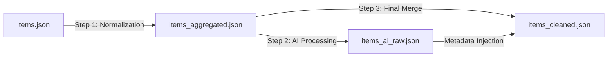

# Design: 3-Step Item Data Pipeline

## Architectural Overview

The transformation is implemented as a sequential 3-step pipeline to ensure robustness and observability.

## Detailed Components

### 1. Normalization (Rule-Based)
**Script**: `step1_aggregate.py`
**Logic**:
-   **Mapping**: Uses `item_normalizer.py` to map synonyms (e.g., `{"姜壶": "养剑葫"}`).
-   **Filtering**: Removes generic terms (e.g., "长剑", "酒") based on a blocklist.
-   **Aggregation**: Groups all raw records by their canonical name.

### 2. AI Processing (Batch-Based)
**Script**: `step2_ai_process.py`
**Strategy**:
-   **Batch Size**: 500 items/batch (Optimized for Throughput).
-   **Model**: `gemini-3-pro-preview` (High concurrency support).
-   **Payload**: `{"role": "user", "parts": [...]}` (Strict requirement for Preview model).
-   **Output**: Structured JSON with fields: `description` (synthesized), `grade`, `status`, `type`.

### 3. Finalization (Integration)
**Script**: `step3_finalize.py`
**Logic**:
-   **Merge**: Combines Rule-based names with AI-generated attributes.
-   **Ownership Logic**: Deduplicates ownership logs by `(Chapter, Owner)` pair and sorts by natural chapter order.
-   **Fallback**: Retains original data if AI processing fails for a specific item.

## Data Schema Changes

### Added Fields
-   `grade` (Enum: 凡物, 灵器, 法宝, 半仙兵, 仙兵, 神器)
-   `status` (Enum: 活跃, 损毁, 遗失, 消耗)
-   `aliases` (List[str]: Auto-extracted synonyms)
