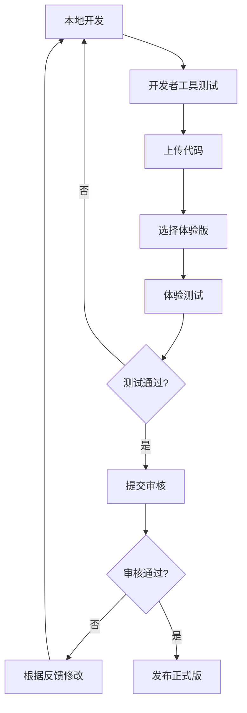

# 设计文档：微信小程序封装方案

## 1. 概述

本文档描述将《剑来·万象图录》H5 应用封装为微信小程序的技术设计。

## 2. 架构设计

### 2.1 整体架构

```
┌─────────────────────────────────────────────────────┐
│                   微信客户端                         │
├─────────────────────────────────────────────────────┤
│  ┌───────────────────────────────────────────────┐  │
│  │           微信小程序 (Native Shell)            │  │
│  │  ┌─────────────────────────────────────────┐  │  │
│  │  │  pages/index/index.wxml                 │  │  │
│  │  │  ┌───────────────────────────────────┐  │  │  │
│  │  │  │  <web-view src="https://..."/>    │  │  │  │
│  │  │  │                                   │  │  │  │
│  │  │  │    ┌─────────────────────────┐   │  │  │  │
│  │  │  │    │   H5 React Application  │   │  │  │  │
│  │  │  │    │   (剑来·万象图录)        │   │  │  │  │
│  │  │  │    └─────────────────────────┘   │  │  │  │
│  │  │  │                                   │  │  │  │
│  │  │  └───────────────────────────────────┘  │  │  │
│  │  └─────────────────────────────────────────┘  │  │
│  └───────────────────────────────────────────────┘  │
└─────────────────────────────────────────────────────┘
```

### 2.2 项目结构

```
miniprogram/
├── app.js                 # 小程序入口
├── app.json               # 全局配置
├── app.wxss               # 全局样式
├── project.config.json    # 开发工具配置
├── sitemap.json           # 搜索配置
└── pages/
    └── index/
        ├── index.js       # 页面逻辑
        ├── index.json     # 页面配置
        ├── index.wxml     # 页面结构
        └── index.wxss     # 页面样式
```

## 3. 核心配置

### 3.1 app.json

```json
{
  "pages": [
    "pages/index/index"
  ],
  "window": {
    "navigationBarTitleText": "剑来·万象图录",
    "navigationBarBackgroundColor": "#3a6ea6",
    "navigationBarTextStyle": "white"
  },
  "style": "v2",
  "sitemapLocation": "sitemap.json"
}
```

### 3.2 pages/index/index.wxml

```xml
<web-view src="{{h5Url}}" bindmessage="onMessage" bindload="onLoad" binderror="onError"></web-view>
```

### 3.3 pages/index/index.js

```javascript
Page({
  data: {
    h5Url: 'https://shushu.host/jianlai/'  // 替换为实际域名
  },
  
  onMessage(e) {
    console.log('收到H5消息:', e.detail);
    // 处理 H5 发送的消息（如分享配置）
  },
  
  onLoad(e) {
    console.log('web-view 加载完成');
  },
  
  onError(e) {
    console.error('web-view 加载失败:', e.detail);
  },
  
  // 分享配置
  onShareAppMessage() {
    return {
      title: '剑来·万象图录 - 你的江湖知识库',
      path: '/pages/index/index',
      imageUrl: '/images/share-cover.png'
    };
  }
});
```

## 4. H5 与小程序通信

### 4.1 H5 端配置

在 H5 应用中引入微信 JS-SDK：

```html
<script src="https://res.wx.qq.com/open/js/jweixin-1.6.0.js"></script>
```

### 4.2 H5 调用小程序 API

```javascript
// 在 web-view 中可用的 API
wx.miniProgram.navigateTo({ url: '/pages/other/other' });
wx.miniProgram.navigateBack();
wx.miniProgram.switchTab({ url: '/pages/index/index' });
wx.miniProgram.reLaunch({ url: '/pages/index/index' });
wx.miniProgram.postMessage({ data: { type: 'share', title: '...' } });
wx.miniProgram.getEnv(function(res) {
  console.log(res.miniprogram); // true 表示在小程序中
});
```

## 5. 性能优化

### 5.1 首屏加载优化

1. **启用 CDN 加速**: 将 H5 静态资源部署到 CDN
2. **代码分割**: 使用 Vite 的代码分割功能，按路由懒加载
3. **资源压缩**: 开启 gzip/brotli 压缩
4. **预加载关键资源**: 使用 `<link rel="preload">`

### 5.2 缓存策略

```javascript
// 在 Service Worker 或 HTTP 头中配置缓存
// HTML: no-cache
// CSS/JS: 长期缓存 + 版本号
// 图片: 长期缓存
```

## 6. 域名配置要求

### 6.1 业务域名

在微信公众平台 → 开发管理 → 开发设置 → 业务域名，添加 H5 的部署域名。

### 6.2 验证文件

需要下载验证文件并放置在域名根目录，确保可通过 `https://shushu.host/xxx.txt` 访问。

### 6.3 HTTPS 要求

- 域名必须支持 HTTPS
- SSL 证书必须有效
- 建议使用 TLS 1.2+

## 7. 发布流程



## 8. 注意事项

1. **审核注意点**:
   - 确保 H5 内容符合微信小程序规范
   - 避免诱导分享、诱导关注等违规内容
   - 确保所有功能可正常使用

2. **兼容性**:
   - web-view 要求基础库版本 >= 1.6.4
   - 个人小程序不支持 web-view
   - 需要已认证的企业/组织主体

3. **限制**:
   - web-view 会自动全屏，无法与其他小程序组件同时展示
   - 分享的是整个 H5 链接，无法分享到指定页面（需要通过 postMessage 配合）
