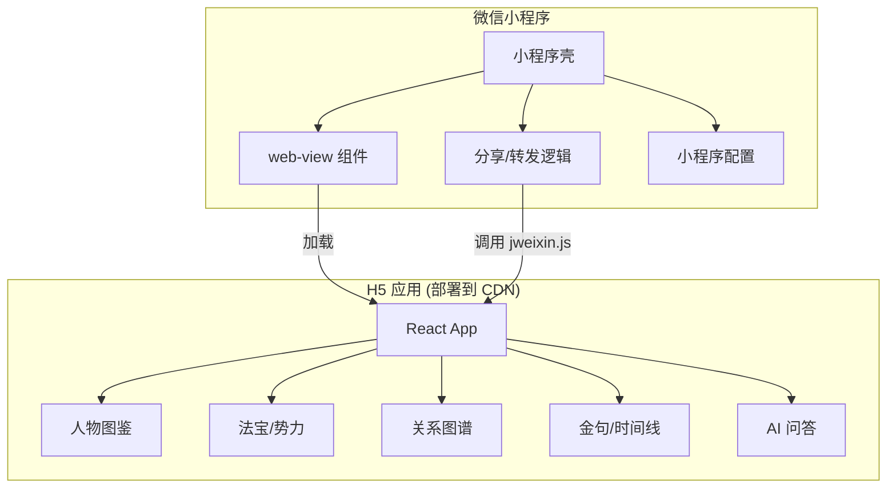

# 将《剑来·万象图录》封装为微信小程序

## 背景

现有的《剑来·万象图录》是一个基于 React + TypeScript + Vite 构建的 Web 应用（H5），包含人物图鉴、法宝/势力图鉴、关系图谱、金句殿堂、AI 问答等功能。为了便于微信生态内的传播和使用，需要将该 H5 应用封装为微信小程序并发布。

## 目标

1. 创建一个微信小程序壳，使用 `web-view` 组件嵌入现有 H5 页面
2. 配置小程序基础信息（名称、图标、描述等）
3. 部署 H5 应用到可公网访问的域名
4. 完成微信小程序的审核与发布

## 用户审核项

> [!WARNING]
> **HTTPS 要求**: 微信小程序的 `web-view` 组件要求域名必须支持 **HTTPS**。
> 当前提供的域名 `http://shushu.host/jianlai` 使用的是 HTTP，需要配置 SSL 证书启用 HTTPS。

### 已确认信息

| 项目 | 状态 | 详情 |
|-----|------|------|
| **部署域名** | ✅ 已提供 | `shushu.host/jianlai` （待配置 HTTPS） |
| **小程序 AppID** | ✅ 已提供 | `wxfcb4da77a987940f` |
| **小程序名称** | ✅ 已确定 | **剑来光阴** |
| **小程序图标** | ✅ 已提供 | `icon.jpg` |
| **功能介绍** | ✅ 无特殊要求 | 使用默认介绍 |

---

## 技术方案

### 方案选择：web-view 嵌入 H5

考虑到现有 H5 应用代码量较大且功能完善，采用 **`web-view` 组件嵌入 H5** 的方案：

| 方案 | 优点 | 缺点 |
|-----|------|-----|
| **web-view 嵌入 H5** ✅ | 复用现有代码、开发周期短、维护成本低 | 首次加载较慢、部分原生能力受限 |
| 跨端框架重写 (uni-app/Taro) | 原生体验更好、可使用更多小程序 API | 需要大量重写代码、开发周期长 |

### 架构图

---

## 变更范围

### 新增组件

| 组件 | 说明 |
|-----|------|
| `miniprogram/` | 微信小程序项目目录 |
| `miniprogram/app.json` | 小程序配置文件 |
| `miniprogram/pages/index/` | 主页面，包含 web-view |
| `miniprogram/project.config.json` | 微信开发者工具配置 |

### 修改组件

| 组件 | 说明 |
|-----|------|
| `frontend/` | 添加 jweixin.js 支持小程序 API 调用（可选） |
| `frontend/index.html` | 添加移动端适配 meta 标签（如有需要） |

### 部署组件

| 组件 | 说明 |
|-----|------|
| H5 构建产物 | 部署到已备案域名 |
| 业务域名配置 | 在微信公众平台添加业务域名 |

---

## 验证计划

### 开发阶段验证

1. **微信开发者工具预览**: 在开发者工具中验证 web-view 正常加载 H5
2. **真机预览**: 扫码在真机上测试页面加载与交互

### 发布阶段验证

1. **体验版测试**: 发布体验版，邀请用户测试完整功能
2. **审核提交**: 提交微信审核，根据反馈进行调整
3. **正式发布**: 审核通过后发布正式版

### 验收标准

- [ ] 小程序能正常打开并加载 H5 页面
- [ ] 所有页面（首页、人物、法宝、势力、关系图谱、金句、时间线）功能正常
- [ ] 小程序分享功能正常工作
- [ ] 页面加载时间 < 3 秒（良好网络环境下）
