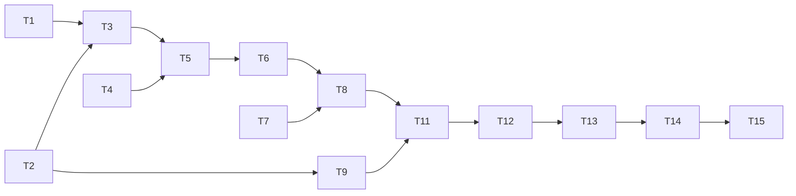

# 任务清单：微信小程序封装

## 阶段一：准备工作

- [x] **T1**: 确认已备案域名可用性
  - 域名：`shushu.host/jianlai`
  - ⚠️ 需要配置 HTTPS（SSL 证书）
  
- [x] **T2**: 确认微信小程序账号
  - AppID：`wxfcb4da77a987940f`
  - 图标：`icon.jpg`

- [x] **T2.5**: 配置域名 HTTPS
  - 用户确认已配置 SSL 证书 ✅

- [ ] **T3**: 在微信公众平台配置业务域名
  - 域名：`shushu.host`
  - 验证：业务域名配置成功，可在开发者工具调试

---

## 阶段二：H5 部署

- [x] **T4**: 构建 H5 生产版本
  ```bash
  cd frontend && npm run build
  ```
  - 验证：`dist/` 目录生成成功 ✅
  
- [x] **T5**: 部署 H5 到已备案域名
  - 部署到 `/var/www/jianlai/`
  - nginx 配置已添加并重载
  - 验证：https://shushu.host/jianlai/ 返回 HTTP 200 ✅

- [x] **T6**: 验证移动端适配
  - 验证：curl 请求返回 HTML 正常 ✅

---

## 阶段三：小程序开发

- [x] **T7**: 初始化小程序项目结构
  - 创建 `miniprogram/` 目录
  - 创建 `app.json`, `app.js`, `app.wxss`
  - 验证：项目结构完整 ✅

- [x] **T8**: 创建主页面 `pages/index/`
  - 实现 `web-view` 组件加载 H5 URL
  - 实现错误处理和重试功能
  - 验证：在开发者工具中能显示 web-view ✅

- [x] **T9**: 配置 `project.config.json`
  - 填入 AppID: `wxfcb4da77a987940f`
  - 配置项目名称: `jianlai-guangyin`
  - 验证：开发者工具识别项目配置 ✅

- [x] **T10**: 实现分享功能
  - 分享给好友: `onShareAppMessage`
  - 分享到朋友圈: `onShareTimeline`
  - 自定义分享标题和图片
  - 验证：点击分享按钮显示自定义内容 ✅

---

## 阶段四：测试与发布

- [ ] **T11**: 开发者工具模拟器测试
  - 验证：所有页面功能正常

- [ ] **T12**: 真机预览测试
  - 验证：真机上页面加载与交互正常

- [ ] **T13**: 上传代码并创建体验版
  - 验证：体验版二维码可扫码访问

- [ ] **T14**: 提交审核
  - 验证：审核通过

- [ ] **T15**: 发布正式版
  - 验证：小程序可通过搜索找到并使用

---

## 依赖关系


